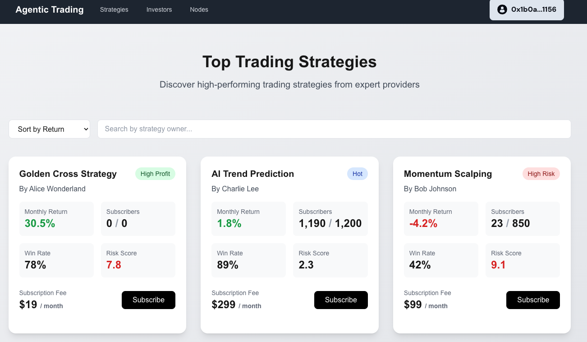
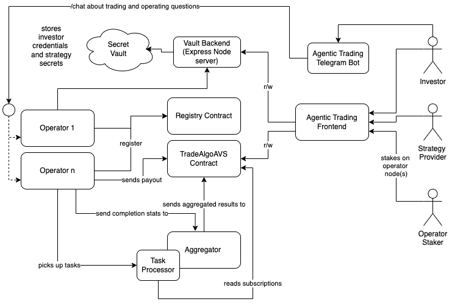
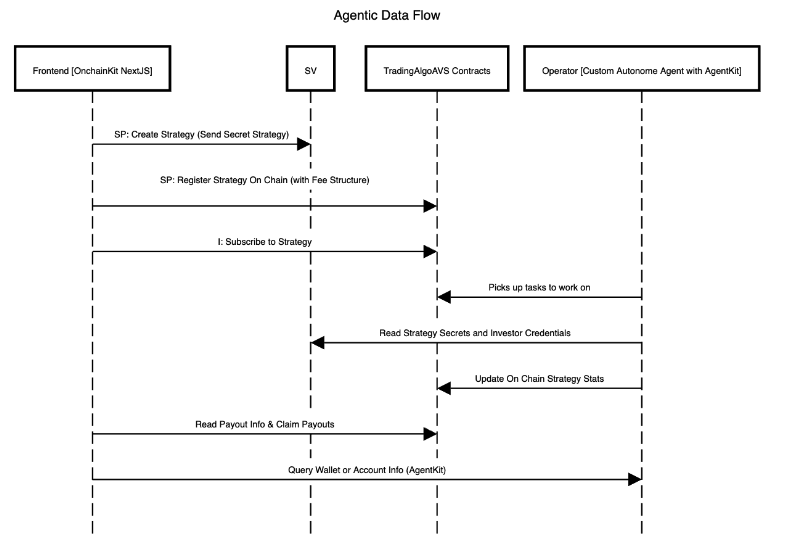

# TradeAlgoAVS

## Overview

**TradeAlgoAVS** Agentic Trading is a decentralized **noncustodial hedge fund platform** where users can create and subscribe to **trading strategies** without transferring custody of their funds. Strategy providers monetize their strategies while keeping their proprietary code confidential, as execution is handled by a network of **off-chain Operators**.

Operators can be **any computational instance** capable of executing strategies securely and correctly. To ensure efficiency and reliability, we have spun up **AI Agent Operators** built from **Custom Templates hosted on Autonome**, which autonomously execute trading strategies as defined by strategy providers.

**TradeAlgoAVS** achieves **trust-minimized execution** and **on-chain verifiability**, while securing the network.

TradeAlgoAVS allows:

1. Successful traders to scale their strategies into hedge fund-like structures without taking on the liabilities of managing client funds.
2. Investors to allocate funds to self-curating, on-chain-verified trading strategies based on performance statistics.
3. Coders and AI engineers to design and develop autonomous trading agents and earn commission.
4. Supporters to stake on operators and participate in the network’s security and growth.

## Comparison: Traditional Hedge Funds vs. TradeAlgoAVS

| Feature                     | Traditional Hedge Fund                                    | TradeAlgoAVS                                        |
|-----------------------------|----------------------------------------------------------|-----------------------------------------------------|
| **Custody of Funds**        | Users must transfer assets to the fund manager.         | Users retain full control of their assets.        |
| **Strategy Transparency**   | Investors blindly trust the hedge fund’s strategy.     | Strategies remain private but validated via statistical proofs. |
| **Execution Model**         | Trades executed by centralized entities.                | Trades executed by decentralized Operators, including AI Agents. |
| **Fees & Access**           | High fees, often locked for long periods.               | Competitive fees, full transparency, and no lock-up periods. |
| **Investor Protection**     | Requires trust in fund managers and regulators.        | On-chain validation ensures fair execution.        |

## Key Functionalities

1. Decentralized & Non-Custodial Trading Strategies
- Users retain full control over their assets.
- Strategy providers monetize their algorithms without revealing their proprietary code.
- Execution is performed by off-chain Operators, including AI agents hosted on Autonome.
2. Trust-Minimized Execution & On-Chain Verification
- Operators stake funds and are slashed for malicious behavior.
- Trading execution is validated using M-of-N statistical aggregation.
- Fraud-proof mechanisms detect deviations from expected performance benchmarks.
- The goal is to implement WYSIWYG literally what you see when you click subscribe in terms of strategy expected performance statistics should be what you get consistently in the long run.
3. Self-Curating Autonomous Strategies
- Strategies are on-chain verified based on real-time performance statistics.
- Poor-performing strategies are naturally filtered out.
- Strategy providers must backtest and paper trade before publishing.

## Deployment on Sonic Blaze Testnet

  [Smart Contract Address: 0x4Cd7fDFf83DC1540696BdaF38840a93134336dF8](https://testnet.sonicscan.org/address/0x4Cd7fDFf83DC1540696BdaF38840a93134336dF8#code)

## Trust Modelling and Protocol Design

